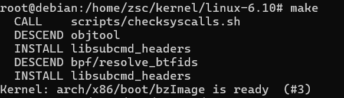
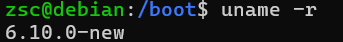
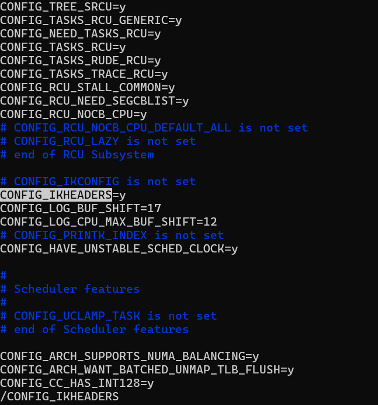
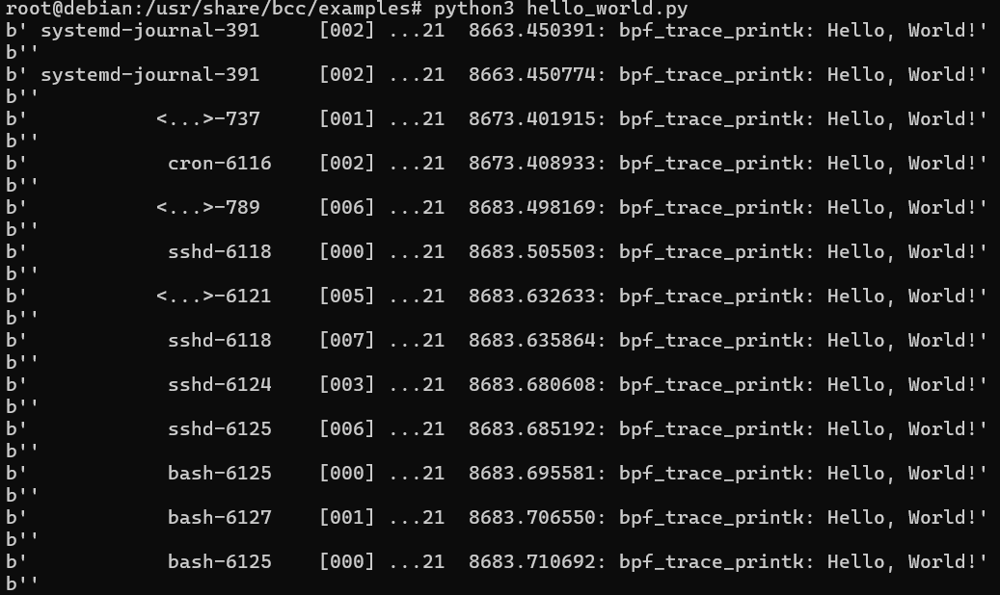
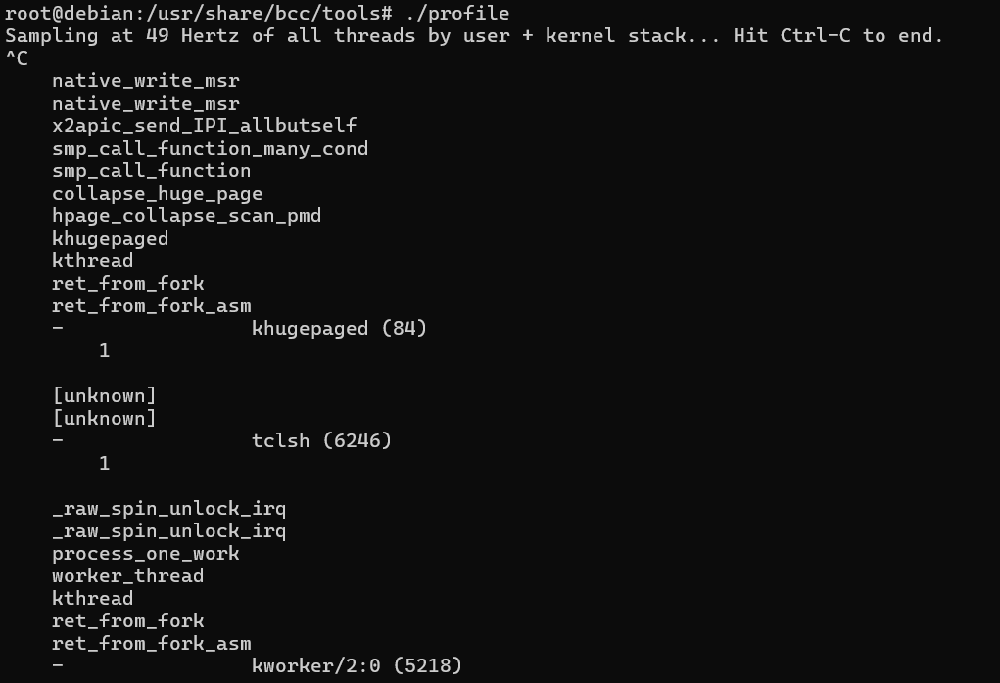
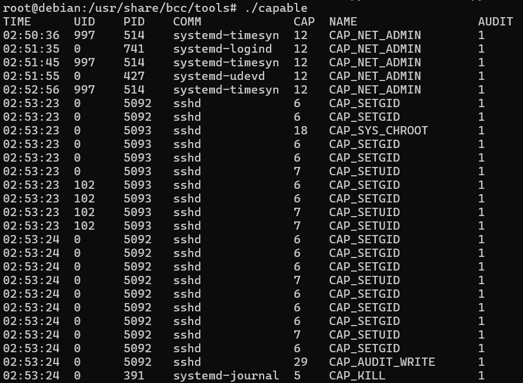

- linux内核编译与安装
  - 选择内核版本6.10
  - 编译  
    
  - 安装
    
  - 改一下grap的配置后boot成功
    

- perf编译
  - 在下载的linux内核源码的更目录中，在`./tools/perf`下可以找到perf的源码
  - 编译成功
    

- bcc
  - 重新编译内核
    - 按照bcc对内核模块的要求，对比当前内核配置，可以发现需要更改flag:CONFIG_IKHEADER为添加至内核中
    - 更改.config后重新编译
      
    - 可以在新内核的配置文件·config-6.10.0-new·中看到新的内核是含有CONFIG_IKHEADER=y的
      
  - 编译bcc
  - 编译完成后跑一些测例
    - hello_world.py
      
    - 一些工具...
      
      
