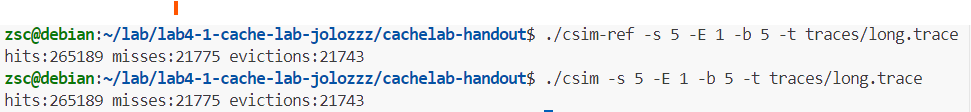

- part A
  - 代码及思路见csim.c
  - 正确性验证
    
- part B
  - 思路：
      
    首先分析32*32的转置。cache的大小为（5，1，5），可先大致确认分块大小为 8*8，简单分块的代码如下
    ```
    for(int i = 0;i<N;i+=8){
      for(int j=0;j<M;j+=8){
          for(int ii=i;ii<i+8;ii++){
              for(int jj=j;jj<j+8;jj++){
                  B[jj][ii] = A[ii][jj];
              }
          }
      }
    } 
    ```
    cache misses数量为344
    
